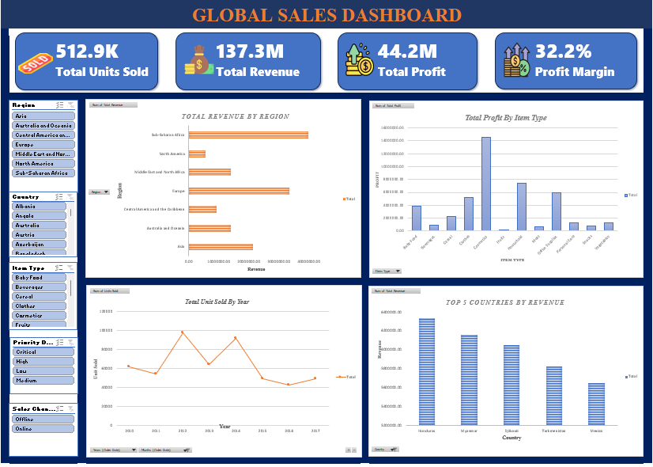

# 🌍 Global Sales Dashboard

## 🔍 Project Overview

This project analyzes global sales data to evaluate business performance across regions, countries, and product categories. The dashboard provides insights into revenue generation, profitability, and sales trends over time.

---

## 🎯 Objective

The objective of this project is to identify high-performing regions and products, analyze sales trends, and evaluate overall business profitability to support strategic decision-making.

---

## 📌 Key Insights

* The business generated **137.3M in total revenue** with a **32.2% profit margin**, indicating strong overall profitability.
* **Sub-Saharan Africa and Europe are the top-performing regions**, contributing significantly to total revenue.
* **Cosmetics is the most profitable product category**, outperforming other item types.
* Total units sold show **fluctuations over time**, with peak performance followed by a decline in later years.
* The **top 5 countries contribute a significant share of revenue**, highlighting concentration in key markets.
* Some regions generate lower revenue, indicating **opportunities for expansion and growth**.

---

## 📊 Dashboard Features

* KPI Cards (Total Revenue, Total Profit, Profit Margin, Total Units Sold)
* Revenue by Region Analysis
* Profit by Item type
* Units Sold By Year
* Top 5 Countries by Revenue
* Interactive Filters (Region, Country, Item Type, Sales Channel, Priority)

---

## 🛠️ Tools & Technologies

* **Excel** – Data cleaning, Pivot Tables, KPI Cards, Dashboard Design

---

## 📁 Dataset Description

The dataset contains global sales transaction data with key fields such as:

* Region and Country
* Product Categories
* Sales and Profit Metrics
* Order Priority and Sales Channel
* Time-based Data (Year, Date)

---

## 🚀 Key Skills Demonstrated

* Data Cleaning and Preparation in Excel
* Pivot Table Analysis
* KPI Development and Business Metrics Tracking
* Dashboard Design and Visualization
* Trend Analysis and Insight Generation

---

## 📷 Dashboard Preview

---

## 📌 Conclusion

This dashboard provides a comprehensive view of global sales performance, highlighting key revenue drivers, profitable regions, and product trends. It supports data-driven decision-making by identifying growth opportunities and performance gaps.

---

